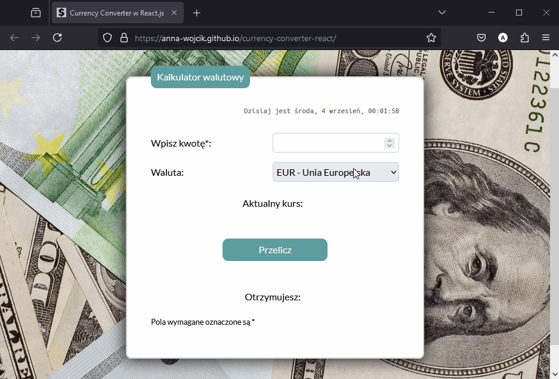

# Currency Converter in React.js
The subject of the project is currency converter. The calculator allows you to convert any amount in the selected currency into polish currency. 
 
Here is a working live demo: https://anna-wojcik.github.io/currency-converter-react/ 
 
This project was bootstrapped with [Create React App](https://github.com/facebook/create-react-app).

## Table of Contents
* [Description](#description)
* [Technologies Used](#technologies-used)
* [Gif](#gif)
* [Available Scripts](#available-scripts)
* [Project Status](#project-status)
* [Room for Improvment](#room-for-improvment)
* [Acknowledgements](#acknowledgements)
* [Author](#author)

## Description
This website depicts a currency converter. It is very easy to use. In the first gap you have to enter the amount of money. Afterwords you can choose one of five currencies. After clicking the button you will see current rate of choosen currency, given in PLN. Under the button you will get amount of converted money to PLN. The current date and time are displayed at the top of the page.
 
The Currency converter <b>uses the API </b> from financial institutions to get the current exchange rates.

## Technologies Used
- JavaScript ES6
- React
- HTML 5
- CSS 3
- axios
- Styled Components
- Hooks (useState, useEffect)
- Custom Hooks
- Media Queries
- Normalize CSS
- BEM Convention

## Gif

## Available Scripts

In the project directory, you can run:

### `npm start`

Runs the app in the development mode.\
Open [http://localhost:3000](http://localhost:3000) to view it in your browser.

The page will reload when you make changes.\
You may also see any lint errors in the console.

### `npm run build`

Builds the app for production to the `build` folder.\
It correctly bundles React in production mode and optimizes the build for the best performance.

The build is minified and the filenames include the hashes.\
Your app is ready to be deployed!

See the section about [deployment](https://facebook.github.io/create-react-app/docs/deployment) for more information.

### `npm run eject`

**Note: this is a one-way operation. Once you `eject`, you can't go back!**

If you aren't satisfied with the build tool and configuration choices, you can `eject` at any time. This command will remove the single build dependency from your project.

Instead, it will copy all the configuration files and the transitive dependencies (webpack, Babel, ESLint, etc) right into your project so you have full control over them. All of the commands except `eject` will still work, but they will point to the copied scripts so you can tweak them. At this point you're on your own.

You don't have to ever use `eject`. The curated feature set is suitable for small and middle deployments, and you shouldn't feel obligated to use this feature. However we understand that this tool wouldn't be useful if you couldn't customize it when you are ready for it.

## Project Status
The project is constantly evolving with my new programming skills.

## Room for Improvment
Room for improvment:
* Access to more currencies
* Converting money not only to polish currency

## Acknowledgements
This project was inspired by the course "Frontend Developer from the basis" by online programming school YouCode. 

## Author
Created by Anna Wójcik.
